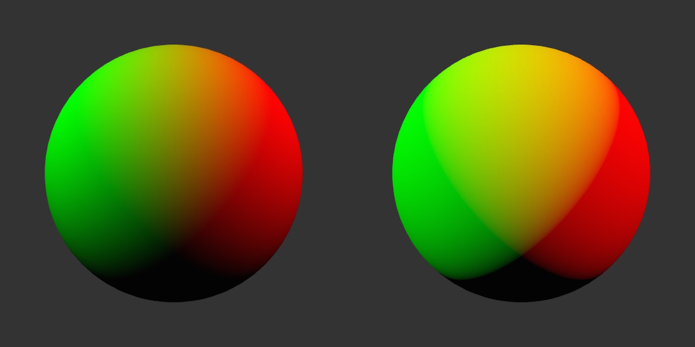
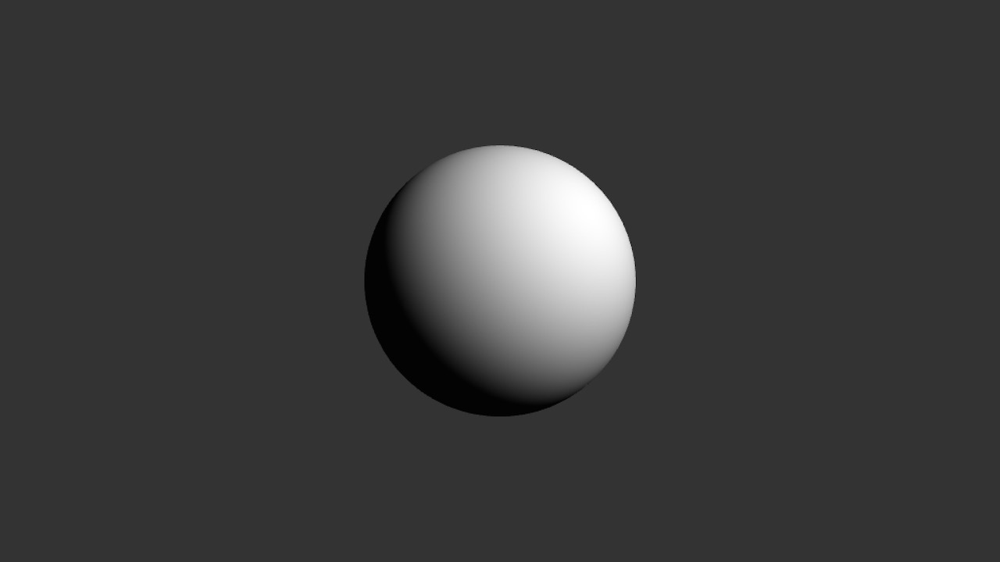
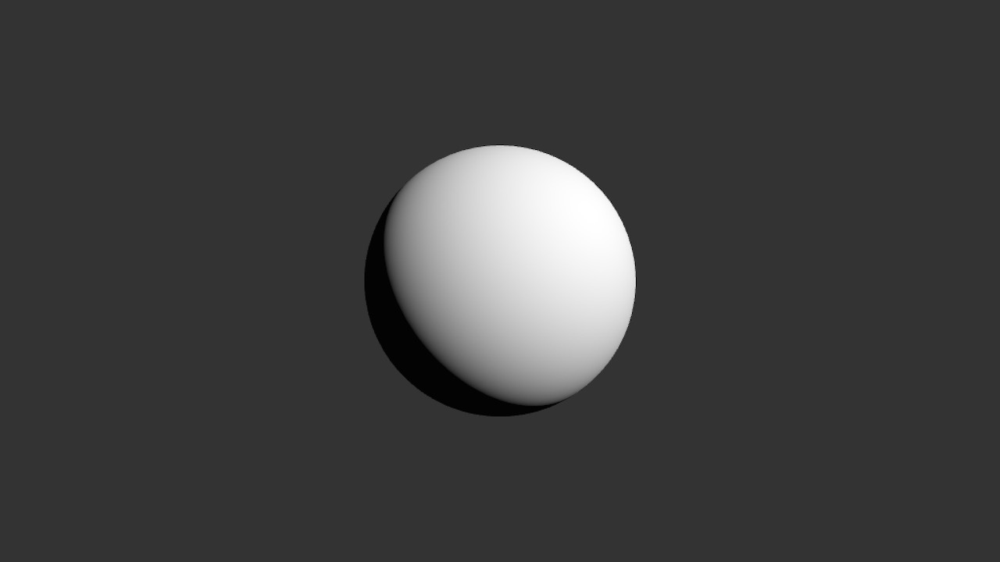
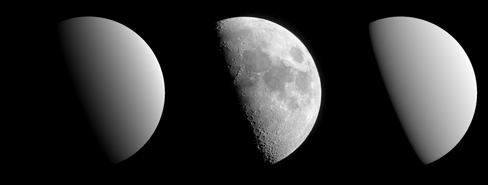
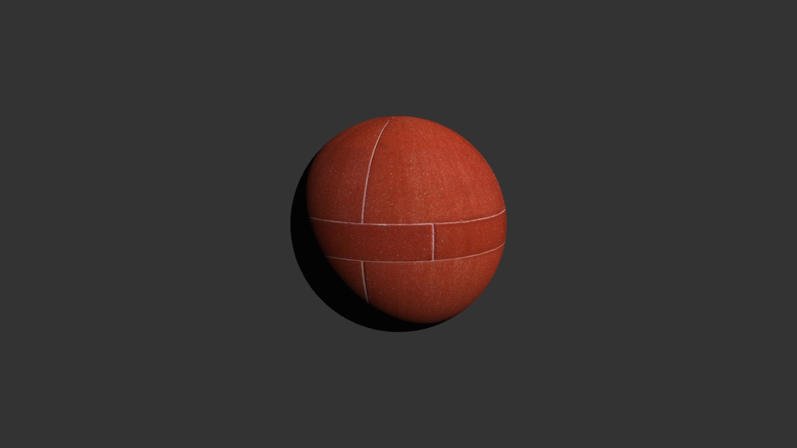

## Pragmatic PBR - Setup & Gamma

This blog post is a part of series about implementing PBR in WebGL from scratch:

1. [Intro](http://marcinignac.com/blog/pragmatic-pbr-intro)
2. [Setup & Gamma](http://marcinignac.com/blog/pragmatic-pbr-setup-and-gamma)

## Setup

Before we start let's make sure we can get the code up and running properly. I will assume you have working knowledge of JavaScript and GLSL.

### NodeJS

Hopefully you also used `nodejs` and `npm` (node package manager) before as we will use it quite a lot here. If you don't have `nodejs` you should install it now from [https://nodejs.org](https://nodejs.org) (this will also install `npm` for you)

### Browser & OS

I'm testing all the code in Safari 8.0.7 (as of time of writing this blog post) on OSX 10.10.4. Most of the code should work in any other major browser (Chrome 43+, Firefox 39+, Safari 8+) and operating system. There are some extensions missing in Safari and Firefox that we will use for specific tasks but I'll always give a warning about it in the related section of each post. Making it work on mobile is not a top priority at the moment but I'll test it as much as I can on the iOS. I don't have an Android device to test with unfortunately (bug fixes and pull requests are welcome!).

### Getting the code

All the code and text for these tutorials lives at [https://github.com/vorg/pragmatic-pbr](https://github.com/vorg/pragmatic-pbr). You can get it by downloading [master.zip](https://github.com/vorg/pragmatic-pbr/archive/master.zip) or via `git`.

```bash
git clone https://github.com/vorg/pragmatic-pbr.git
```

Next let's enter the repo folder and install the dependencies.

```bash
cd pragmatic-pbr
npm install
```

### Running the code

To make sure everything works run the following command while in `pragmatic-pbr` directory.

```bash
beefy 201-init/main.js --open --live -- -i plask
```

This should open your browser at [http://127.0.0.1:9966](http://127.0.0.1:9966) and display a rectangle that changes colors (click to see live version)

[](201-init/)

What is beefy? [Beefy](https://www.npmjs.com/package/beefy) is a local server that boundles our code and required node modules into one JS file using [browserify](http://browserify.org) that can be loaded by the browser. It also watches for changes (when run with `--live` flag) and will reload the page when you edit and save the JS file. Running a local server also solves a number of issues with AJAX requests and local file access policies in the browsers. In the `-- -i plask` part we have `browserify` flags where we ignore `plask` module. [Plask](http://plask.org) is a multimedia programming environment for OSX built on top of NodeJS and implementing WebGL v1.0+ spec. You can use it to run WebGL apps on OSX without the browser. I use it for development but we won't be using it in this tutorial.

### Deploying the code

If you build on top of this tutorial and would like to have standalone (bundled) version that doesn't need beefy to run you can run the `browserify` yourself:

```bash
browserify 201-init/main.js -i plask -o 201-init/main.web.js
```

You will then need to add following `201-init/index.html` file:

```html
<!DOCTYPE html>
<html lang="en">
<head>
    <meta charset="UTF-8">
    <title>Pragmatic PBR</title>
    <script src="main.web.js"></script>
</head>
<body>
</body>
</html>
```

### Dependencies

##### Pex

When I said 'from scratch' I was relating to modern rendering and PBR specific techniques. We don't want to reinvent the wheel and implement things like texture loading and creating WebGL context. For these boring parts we will be using `pex`. PEX is a WebGL library standing somewhere between [stack.gl](http://stack.gl) micromodules and monolithic [three.js](http://threejs.org) (although they started upgrading to a [more modular](https://github.com/mrdoob/three.js/issues/6280#issuecomment-85709471) code recently). This project is using next version of pex that's currently in development. There are numerous differences between this version and [the one currently on npm](http://vorg.github.io/pex/):

- Moving away from proprietary Vec3, Mat4 etc in favor of arrays [x, y, z] etc. This allows better compatibility with existing npm modules and avoids marshalling (converting arrays to Vec3 etc) and simplifies serialization.
- Proper WebGL context abstraction with 1:1 wrappers for core WebGL objects (Texture, Framebuffer, VertexArray etc), state stack and extensions loading.
- Even bigger modularization (pex-glu -> pex-context, pex-cam, pex-geom -> pex-math, pex-geom, geom-subdivide). We are still in minimodules realm (multiple classes per module) with per class imports (pex-sys/Window) as we believe in API consistency. At the same time micromodules (single function, single class) are used whenever possible (e.g. is-browser, glsl-inverse)
- [glslify](https://github.com/stackgl/glslify) for modular shader development
- New main contributor [Henryk Wollik](https://github.com/automat) and therefore many cool ideas from [foam-gl](https://github.com/automat/foam-gl)

As this version of pex is not on `npm` yet (the beauty of always alpha software) so we will require it straight from the GitHub. This is not a problem for `npm`. All we need to do is put the username (variablestudio is an org name for my studio [variable.io](http://variable.io) before the package name in [package.json](https://github.com/vorg/pragmatic-pbr/blob/master/package.json#L19) where all the dependencies are specified and installed when calling `npm install`.

```json
"dependencies": {
    "pex-cam": "variablestudio/pex-cam",
    "pex-context": "variablestudio/pex-context",
    "pex-io": "variablestudio/pex-io",
    "pex-math": "variablestudio/pex-math",
    "pex-sys": "variablestudio/pex-sys"
}
```

##### 3rd party dependencies

We will use modules available on `npm` whenever possible for both JavaScript (e.g [re-map](https://www.npmjs.com/package/re-map)) and GLSL via `glslify` (e.g. [glsl-inverse]((https://www.npmjs.com/package/glsl-inverse)))

##### Local dependencies

Recently I've started a new practice of extracting reusable code into micromodules as soon as possible in the project to prevent them from capturing too much context and becoming part of the spaghetti that every projects ends up in eventually (especially with last minute fixes). I put them in the `local_modules` folder and require as usual:

```javascript
var createCube   = require('../local_modules/primitive-cube');
```

Most of them will eventually end up on `npm` but I want to make sure the API is tested in practice so we avoid v0.0.0 zombie modules that are abandoned after the first push (`npm` is full of them unfortunately).

## 201-init


```javascript
var Window = require('pex-sys/Window');
Window.create({
    settings: {
        width: 1024,
        height: 576
    },
    init: function() {
        console.log('init');
    },
    draw: function() {
        var ctx = this.getContext();
        frame++;
        var r = 0.5 + 0.5 * Math.sin(frame/10);
        var g = 0.5 + 0.5 * Math.cos(frame/10 + Math.PI/2);
        var b = 0.5 + 0.5 * Math.sin(frame/10 + Math.PI/4);
        ctx.setClearColor(r, g, b, 1.0);
        ctx.clear(ctx.COLOR_BIT);
    }
})
```

## 202-lambert-diffuse

[](202-lambert-diffuse/)


*202-lambert-diffuse/Material.vert*:
```glsl
attribute vec4 aPosition;
attribute vec3 aNormal;

uniform mat4 uProjectionMatrix;
uniform mat4 uViewMatrix;
uniform mat4 uModelMatrix;
uniform mat3 uNormalMatrix;

uniform vec3 uLightPos;

varying vec3 ecNormal;
varying vec3 ecLight;
varying vec3 ecPosition;

void main() {
    vec4 pos = uViewMatrix * uModelMatrix * aPosition;
    ecPosition = pos.xyz;
    gl_Position = uProjectionMatrix * pos;
    ecLight = vec3(uViewMatrix * uModelMatrix * vec4(uLightPos, 1.0));
    ecNormal = uNormalMatrix * aNormal;
}
```

*202-lambert-diffuse/Material.frag*:

```glsl
#pragma glslify: lambert   = require(glsl-diffuse-lambert)

varying vec3 ecNormal;
varying vec3 ecLight;
varying vec3 ecPosition;

void main() {
    vec3 N = normalize(ecNormal);
    vec3 L = normalize(ecLight - ecPosition);
    vec3 V = normalize(-ecPosition);
    float diffuse = lambert(L, N);

    //albedo
    vec4 baseColor = vec4(1.0);

    vec4 finalColor = vec4(baseColor.rgb * diffuse, 1.0);
    gl_FragColor = finalColor;
}
```

*glsl-diffuse-lambert*:
```glsl
float lambertDiffuse(vec3 lightDirection, vec3 surfaceNormal) {
  return max(0.0, dot(lightDirection, surfaceNormal));
}
```

## 203-gamma

[Wikipedia: Gamma_correction](https://en.wikipedia.org/wiki/Gamma_correction)


PBR looks good because it's trying to avoid errors and approximations that accumulate across different rendering stages (color sampling, lighting / shading, blending etc). One of these assumptions is that

[](https://www.youtube.com/watch?v=LKnqECcg6Gw)

Other links worth checking out:

- [The Importance of Being Linear (2008)](http://http.developer.nvidia.com/GPUGems3/gpugems3_ch24.html)
- [Linear-Space Lighting (i.e. Gamma) (2010)](http://filmicgames.com/archives/299)
- [Gamma and Linear Spaces](http://www.codinglabs.net/article_gamma_vs_linear.aspx)
- [Gamma-Correct Lighting (2010)](http://www.gamasutra.com/blogs/DavidRosen/20100204/4322/GammaCorrect_Lighting.php)

http://renderwonk.com/blog/index.php/archive/adventures-with-gamma-correct-rendering/ ??
http://d.hatena.ne.jp/hanecci/20120108 ??

[](203-gamma-manual/)


*203-gamma/Material.frag*:
```glsl
#pragma glslify: lambert   = require(glsl-diffuse-lambert)
#pragma glslify: toLinear = require(glsl-gamma/in)
#pragma glslify: toGamma  = require(glsl-gamma/out)

varying vec3 ecNormal;
varying vec3 ecLight;
varying vec3 ecPosition;

float PI = 3.14159265;

void main() {
    vec3 N = normalize(ecNormal);
    vec3 L = normalize(ecLight - ecPosition);
    vec3 V = normalize(-ecPosition);
    //float diffuse = lambert(L, N) / PI;
    float diffuse = lambert(L, N);

    //albedo
    vec4 baseColor = toLinear(vec4(1.0));

    vec4 finalColor = vec4(baseColor.rgb * diffuse, 1.0);
    gl_FragColor = toGamma(finalColor);
}
```

*glsl-gamma/in*:
```glsl
const float gamma = 2.2;

vec3 toLinear(vec3 v) {
  return pow(v, vec3(gamma));
}

vec4 toLinear(vec4 v) {
  return vec4(toLinear(v.rgb), v.a);
}
```

*glsl-gamma/out*:
```glsl
const float gamma = 2.2;

vec3 toGamma(vec3 v) {
  return pow(v, vec3(1.0 / gamma));
}

vec4 toGamma(vec4 v) {
  return vec4(toGamma(v.rgb), v.a);
}
```

This looks pretty much like an object i've seen somewhere before... as Vincent Scheib is pointing on his [Beautiful Pixels blog](http://beautifulpixels.blogspot.co.uk/2009/10/gamma-correct-lighting-on-moon.html)



## 204-gamma-color

I made a spearate example with two lights


## 205-gamma-texture



## 206-gamma-srgb-ext


## TODO:

- [ ] switch from point light to directional light
