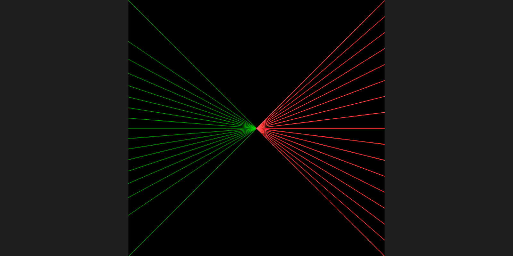
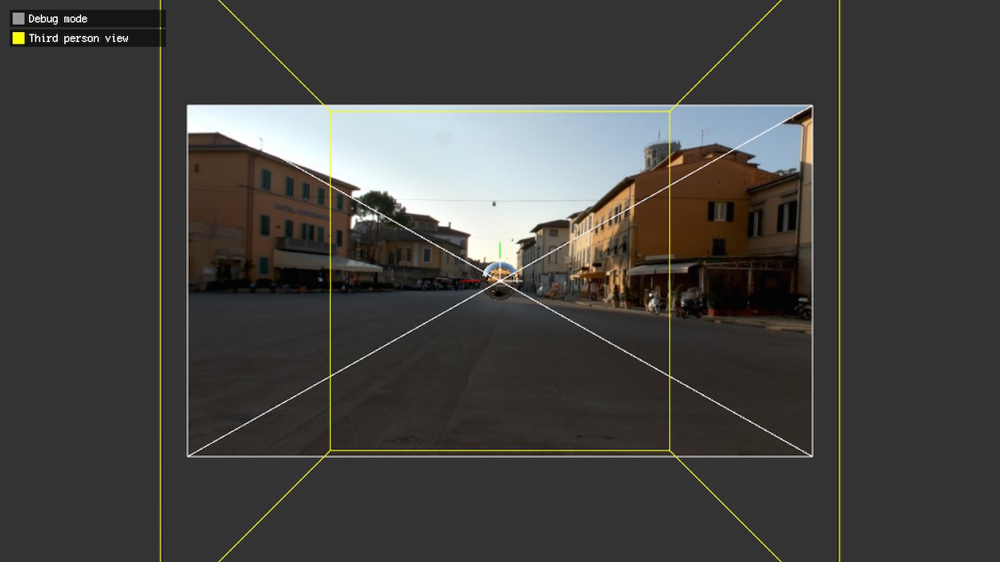
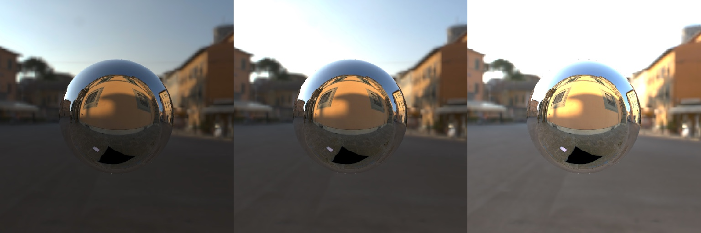
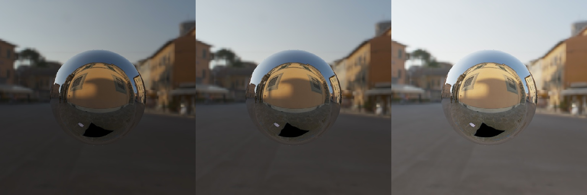
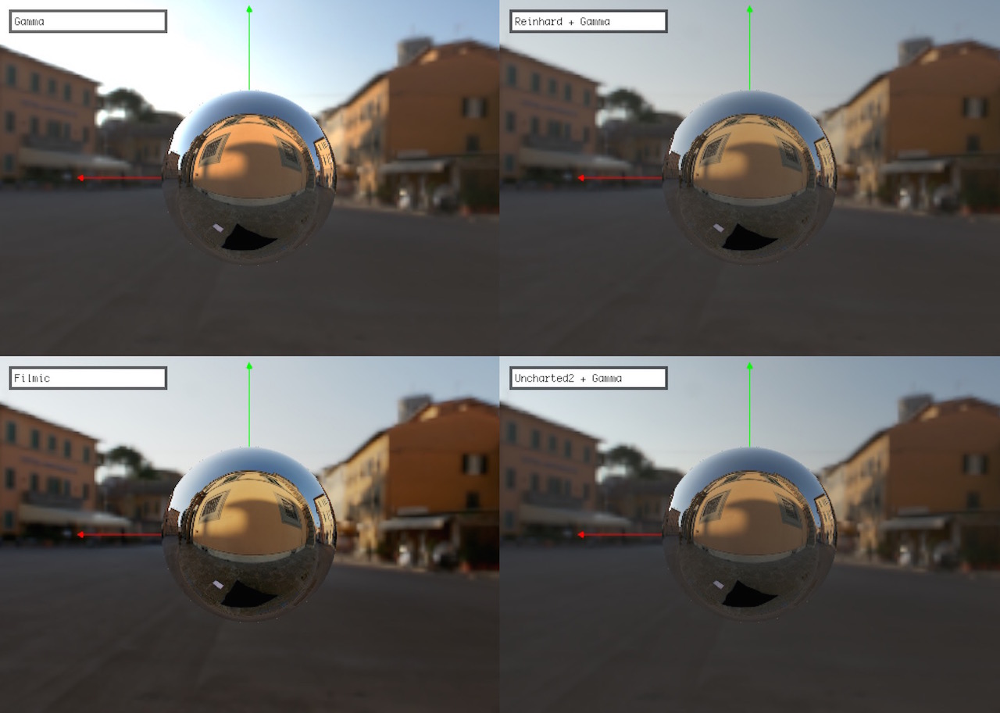

# Pragmatic PBR - HDR

This blog post is a part of series about implementing PBR in WebGL from scratch:

1. [Intro](http://marcinignac.com/blog/pragmatic-pbr-intro)
2. [Setup & Gamma](http://marcinignac.com/blog/pragmatic-pbr-setup-and-gamma)
2. **[HDR](http://marcinignac.com/blog/pragmatic-pbr-hdr)**

## What is HDR?

Traditional images (e.g. your average JPG) represent color values as numbers from 0..255 (or 0..1 in GLSL). This is not how light behaves in real life e.g. sunshine is 1000s times brighter than a lightbulb. In oder to fit the lighting information (pixel brightness / color) into that LDR (Low Dynamic Range) space some of the information has to be lost. That's clearly visible when you take a photo again the sun and suddenly everything else is black or the opposite you focus on your face but the whole background is overexposed.


HDR - High Dynamic Range images on the other side allow you to store image data with values above 255. That allows you to capture both the dark and bright areas at the same time. We can then adjust the exposure of the photo in realtime to focus on the desired range or apply process called tonemapping to avoid over or under exposing the image.

## 301-load-cubemap ([code](https://github.com/vorg/pragmatic-pbr/blob/master/301-load-cubemap/main.js))

One of the best source of HDR images are so called environment maps. That fully capture the environment around you not only at 360' but also above and below.

We can represent that that environment as a cube surrounding the viewer hence the name of such textures in WebGL : *CubeMaps*. Below you can see cross representation of a CubeMap with 6 sides facing the axis as follows:
<span style="color:red">+X</span>,
<span style="color:red">-X</span>,
<span style="color:green">+Y</span>,
<span style="color:green">-Y</span>,
<span style="color:blue">+Z</span>,
<span style="color:blue">-Z</span>.


I would be a bit cumbersome to upload such a texture to the GPU so a better way is to load all the faces separately.


#### Cubemap Orientation

[](https://www.google.com/maps/@43.7222461,10.3980709,3a,75y,283.86h,85.5t/data=!3m6!1e1!3m4!1s-cEOTnId34DBxCCQgeIbGQ!2e0!7i13312!8i6656)
[Click to see the streetview](https://www.google.com/maps/@43.7222461,10.3980709,3a,75y,283.86h,85.5t/data=!3m6!1e1!3m4!1s-cEOTnId34DBxCCQgeIbGQ!2e0!7i13312!8i6656)

#### Code

Here is how load the CubeMap in Pex:
```javascript
Window.create({
    settings: {
        width: 1024,
        height: 576,
        fullscreen: isBrowser
    },
    resources: {
        //first we load 6 images, one per face
        envMap_px: { image: ASSETS_DIR + '/envmaps/pisa_posx.jpg' },
        envMap_nx: { image: ASSETS_DIR + '/envmaps/pisa_negx.jpg' },
        envMap_py: { image: ASSETS_DIR + '/envmaps/pisa_posy.jpg' },
        envMap_ny: { image: ASSETS_DIR + '/envmaps/pisa_negy.jpg' },
        envMap_pz: { image: ASSETS_DIR + '/envmaps/pisa_posz.jpg' },
        envMap_nz: { image: ASSETS_DIR + '/envmaps/pisa_negz.jpg' },
    },
    init: function() {
        //then we create cubemap texture
        this.envMap = ctx.createTextureCube([
            { face: 0, data: res.envMap_px },
            { face: 1, data: res.envMap_nx },
            { face: 2, data: res.envMap_py },
            { face: 3, data: res.envMap_ny },
            { face: 4, data: res.envMap_pz },
            { face: 5, data: res.envMap_nz }
        ])
    }
})
```

#### Skybox

```javascript
//TODO
```

#### Reflection

```javascript
//TODO
```

Whole code is available on GitHub in [301-load-cubemap/main.js](https://github.com/vorg/pragmatic-pbr/blob/master/301-load-cubemap/main.js).

You can play with the live version that includes debug mode showing the sides of the cube and third person view showing you the whole scene.

[](http://marcinignac.com/blog/pragmatic-pbr-hdr/301-load-cubemap/)
[Open live version in a separate window](http://marcinignac.com/blog/pragmatic-pbr-hdr/301-load-cubemap/)


## 302-load-equirect

[](http://marcinignac.com/blog/pragmatic-pbr-hdr/302-load-equirect/)
[Open live version in a separate window](http://marcinignac.com/blog/pragmatic-pbr-hdr/302-load-equirect/)



## 303-fullscreenquad-skybox

[](http://marcinignac.com/blog/pragmatic-pbr-hdr/303-fullscreenquad-skybox/)
[Open live version in a separate window](http://marcinignac.com/blog/pragmatic-pbr-hdr/303-fullscreenquad-skybox/)

## 304-load-hdr

[](http://marcinignac.com/blog/pragmatic-pbr-hdr/304-load-hdr/)
[Open live version in a separate window](http://marcinignac.com/blog/pragmatic-pbr-hdr/304-load-hdr/)

## 305-exposure-basic

[](http://marcinignac.com/blog/pragmatic-pbr-hdr/305_exposure_basic/)
[Open live version in a separate window](http://marcinignac.com/blog/pragmatic-pbr-hdr/305_exposure_basic/)

## 306-tonemap-reinhard


Exposure levels

[](http://marcinignac.com/blog/pragmatic-pbr-hdr/306-tonemap-reinhard/)
[Open live version in a separate window](http://marcinignac.com/blog/pragmatic-pbr-hdr/306-tonemap-reinhard/)

## 307-tonemap-compare

[](http://marcinignac.com/blog/pragmatic-pbr-hdr/307-tonemap-compare/)
[Open live version in a separate window](http://marcinignac.com/blog/pragmatic-pbr-hdr/307-tonemap-compare/)

## 308-exposure-camera

TODO: Link to the camera article

[](http://marcinignac.com/blog/pragmatic-pbr-hdr/308-exposure-camera/)
[Open live version in a separate window](http://marcinignac.com/blog/pragmatic-pbr-hdr/308-exposure-camera/)
